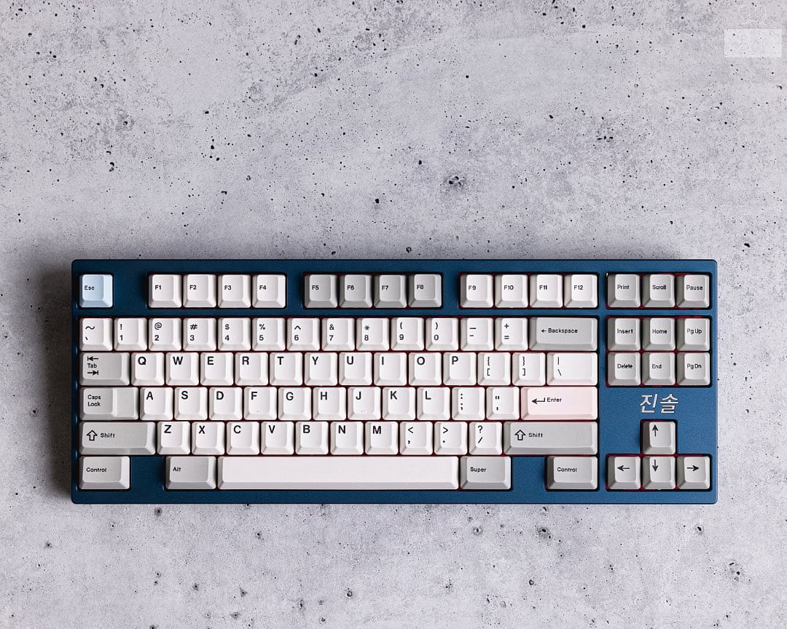
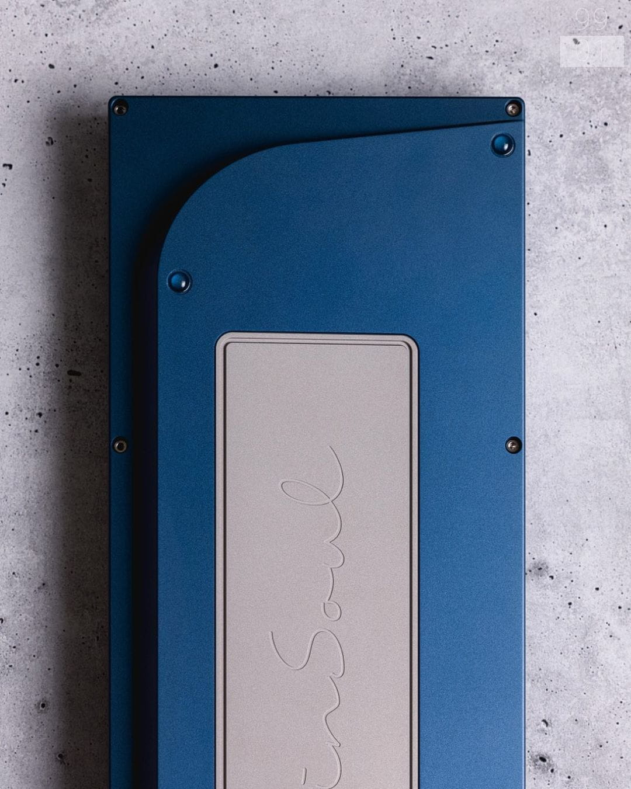
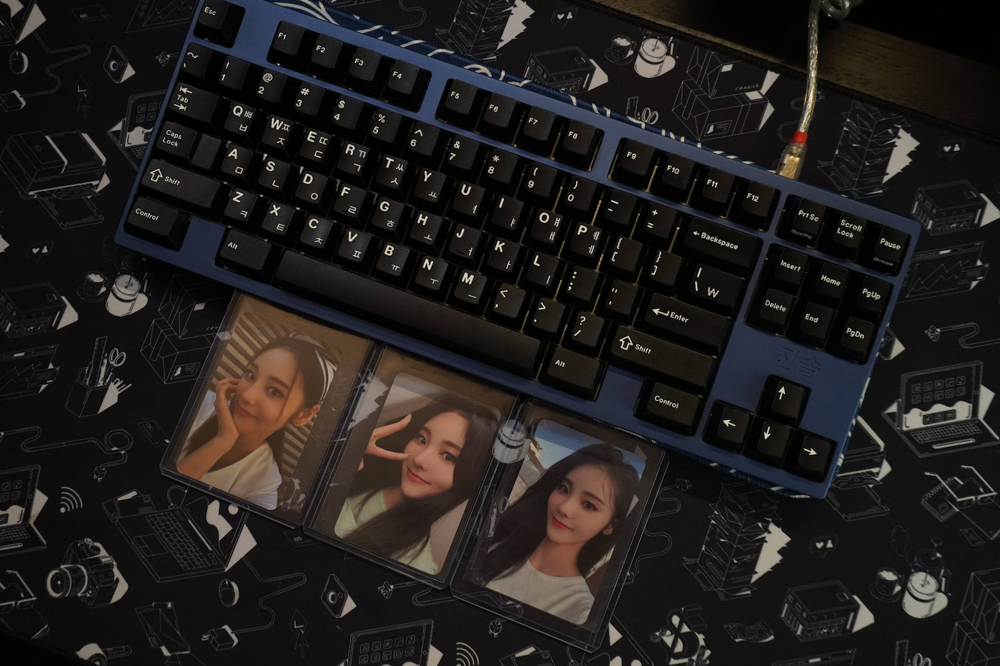
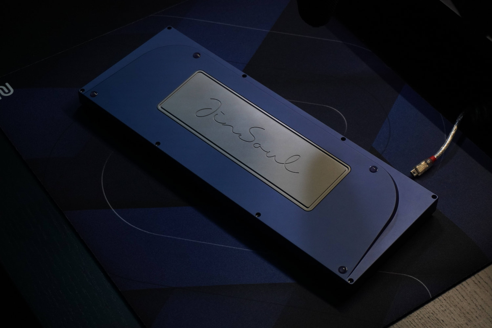

# JinSoul

## General Information

The JinSoul is a WKL TKL inspired by the Chuupad, Camp C225, KeyCult No. 1. Like many other keyboards that utilize four bumpon style feet, the feet are placed in the four corners of the bottom face of the keyboard that make contact with the desk.

## Specification

Typing Angle: 6.9420°

Mounting Style: Top Mount

Front Height: 17mm

PCB: hineybush h87a (South Facing Spacebar)

## Replacement Parts

### Plate

The plate file can be found [here](../src/assets/file/jinsoul_plate.dxf). 

Note: The file does **not** account for [kerf](https://help.ponoko.com/en/articles/4442594-how-much-material-does-the-laser-burn-away).

### Screws

Case: [M2.5 x 0.45 mm Thread, 8 mm Length, Socket Head](https://www.mcmaster.com/91292A012/)

Plate: [M2.5 x 0.45 mm Thread, 6 mm Length, Socket Head](https://www.mcmaster.com/91292A010/)

Weight: [M4 x 0.70 mm Thread Size, 5 mm Length, Flat Head](https://www.mcmaster.com/91263A442/)

## Media

Photos by [@ninjapirate9901](https://www.instagram.com/ninjapirate9901/)

Photos by darian